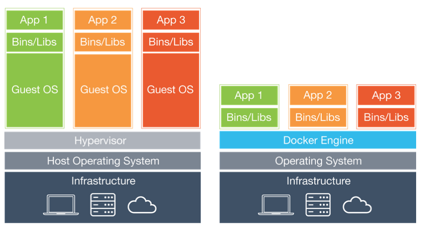

### K8s(Kubernetes)란?

운영수준에서 수많은 Container는 생성되고 삭제된다. (최근 지속적 배포 및 다양한 배포방식을 적용하게 되면 계속해서 Container는 변경된다) 이들을 개발자가 계속해서 관리하는 것은 불가능에 가깝다. 따라서 Kubernetes는 discovery와 load balancing , monitoring등 container환경에서의 배포를 쉽게 관리 할 수 있도록 도와준다.

>한정적인 하드웨어를 효율적으로 사용하기 위해 다양한 기술이 발전해 왔고 VM이 대표적이라고 할 수 있다. VM은 각자의 운영체제를 가지고 움직이기 때문에 자원의 낭비가 있어 이를 해겨하기 위해 Container라는 기술이 사용되고 있다. Continer는 가볍기 때문에 생성과 삭제에 용이하다. Docker를 통해 Container를 구축할 수 있게 된다. 

### Cluster, node, pods, services에 대한 개념
1. Cluster
    
    K8s(Kubernetes에서 )

###### [kubernetes 공식문서](https://kubernetes.io/ko/docs/concepts/overview/what-is-kubernetes/)