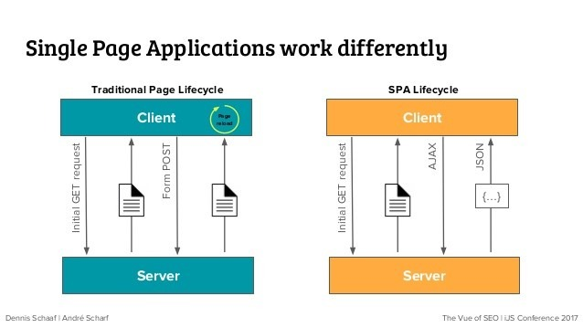

## Web server 와 WAS(Web Application Server)

* WAS(Web Application Server)

    클라이언트가 DB조회나 로직을 수행한 결과값을 요청하는 경우에 WWS에서 이를 처리한 후 결과값을 반환해 주는 서버. 컨테이너, 웹컨테이너, 서블릿 컨테이너라고도 부른다. 
    즉 동적인 콘텐츠(JSP, 서블릿처리, HTTP요청 수신 및 응답)을 담당해서 처리하는 서버이다.
    * Tomcat, Jeus, JBoss
        
        >Tomcat은 동적인 데이터를 처리하기 위해 만들어진 것으로 Apache에 비해 속도가 느리고 대량의 트래픽에 약하다. 따라서  Apache와 연결을 통해 정적인 콘텐츠를 처리해줘야한다.
        Apache Tomcat은 Tomcat에서 Apache의 일부 기능을 제공한다.

* Web server 

    클라이언트가 정적인 콘텐츠(.html, .png, .css 등)를 요청하면 Web server가 바로 처리해 요청결과를 반환한다. 
    * Apache, nginx, Amazon S3 등으로 server 구성

    

---

#### SPA에서의 Web server, WAS 구성 --> Nodejs server & WAS server

* SPA(Single Page Application)란 ? 

    최근 웹의 트랜드라고 할 수 있는 SPA는 하나의 페이지(ex. index.html)에서 모든 일을 수행하는 것을 말한다. 전통적인 웹 방식은 필요한 페이지를 요청하고 응답받는 형태였다. SPA는 초기에 모든 데이터를 호출하고 Ajax(Asynchronous Javascript and XML / 서버 클라이언트 통신 기법)를 사용하여 필요한 데이터를 업데이트 하는 형식으로 변화했다. 초기 데이터를 호출하는데 시간이 들지만 필요한 부분만 변경하여 처리속도를 향상시킬 수 있다. 
    > SPA의 경우 단순한 한 페이지만 검색엔진에 노출되므로 검색에 취약하다는 단점이 있음 --> SSR로 해결

    
    

* SPA 구축을 위한 도구 - React.js, Vue.js, Angular.js

    위의 세가지 framework는 javascript기반으로 SPA로 제작하는데 유용하다.
    이들은 nodejs server에서 동작하게 된다. 따라서 nodejs server에 대한 이해가 필요하다

* Node vs Web server 
    
    Node server는 runtime으로돌아가는 서버로 단순한 정적인 파일만 응답해주는 web server와는 다른 구조를 가지고 있다. 위의 framework들은 node기반의 서버에서 돌아가며 브라우저에서의 요청을 처리한다. spring boot와 같이 Tomcat기반의 API server와 통신하며 웹이 동작하게 된다.
    SPA라는 새로운 방식을 도입하기 위해서는 기존의 web server와 was가 이에 맞는 Nodejs server를 사용하기 시작하는 것으로 보인다.
    
    > 이 부분은 자료들을 학습중인 부분들이라 틀릴 수도 있음!

---

###### 참고자료
[Was와 웹서버 차이](https://jeong-pro.tistory.com/84)
