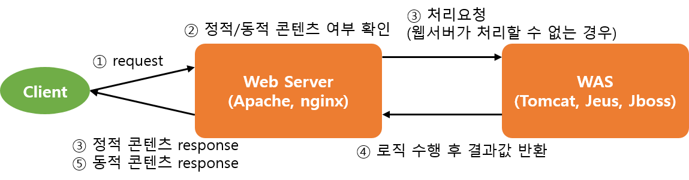
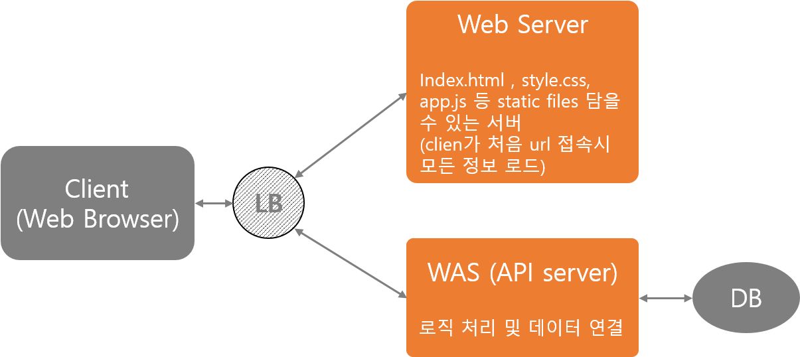

## Web server 와 WAS(Web Application Server)

* WAS(Web Application Server)

    클라이언트가 DB조회나 로직을 수행한 결과값을 요청하는 경우에 WWS에서 이를 처리한 후 결과값을 반환해 주는 서버. 컨테이너, 웹컨테이너, 서블릿 컨테이너라고도 부른다. 
    즉 동적인 콘텐츠(JSP, 서블릿처리, HTTP요청 수신 및 응답)을 담당해서 처리하는 서버이다.
    * Tomcat, Jeus, JBoss
        
        >Tomcat은 동적인 데이터를 처리하기 위해 만들어진 것으로 Apache에 비해 속도가 느리고 대량의 트래픽에 약하다. 따라서  Apache와 연결을 통해 정적인 콘텐츠를 처리해줘야한다.
        Apache Tomcat은 Tomcat에서 Apache의 일부 기능을 제공한다.

* Web server 

    클라이언트가 정적인 콘텐츠(.html, .png, .css 등)를 요청하면 Web server가 바로 처리해 요청결과를 반환한다. 
    * Apache, nginx, Amazon S3 등으로 server 구성

    

---

#### SPA에서의 Web server, WAS 구성 

---

###### 참고자료
[Was와 웹서버 차이](https://jeong-pro.tistory.com/84)
